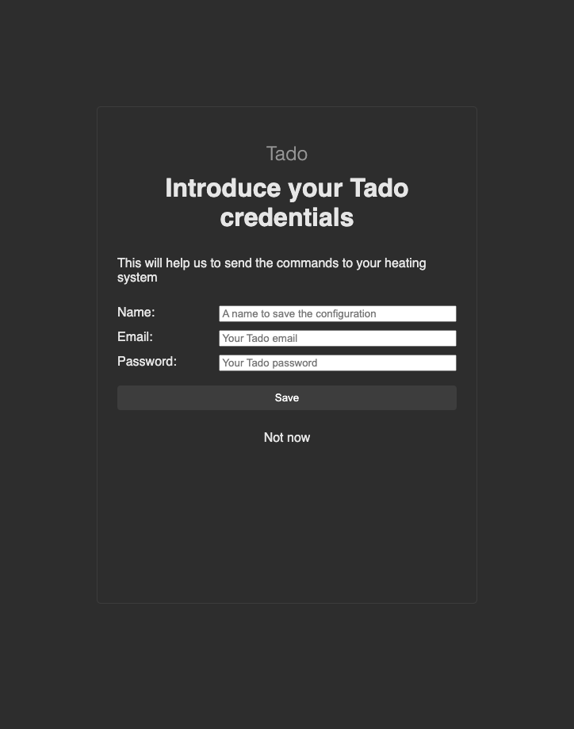
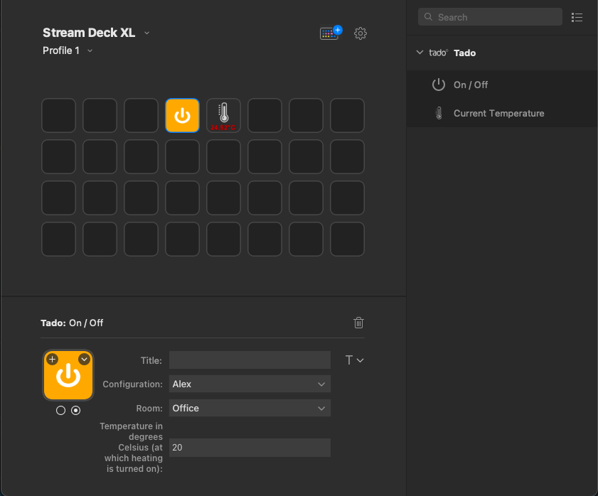
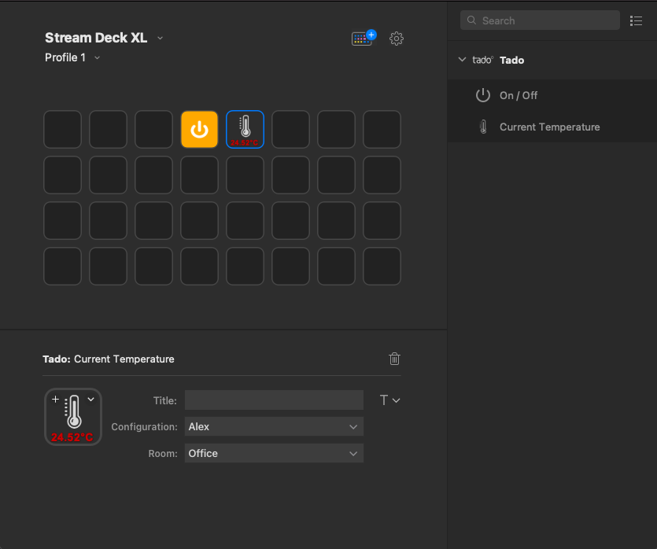

# Description (English)

`Tado` is a Basic [Stream Deck](https://elgato.com/stream-deck/) plugin to turn on and off the heating in one room using [tado](https://www.tado.com) termostat.

## Features

- You can turn on and off a termostat in your house using your Stream Deck configuraion.
- You can see the current temperature (in Celsius) from one of your termostats on your Stream Deck.
- The plugin is in English and Spanish

## Instalation

- On the dist folder, you will find the plugin called `dev.aperez.tado.streamDeckPlugin`. Just double click on this file, Stream Deck will install the plugin.

## Configuration

### Common config for all actions

- Create a new configuration.
- Give it an unique name for your settings.
- Introduce your email and your password for your account from [tado website](https://app.tado.com/#/account/sign-in)
- Click Save.

### For on/off only

- You must choose your room and set the temperature for turning on the termostat, in celsium.
- The first icon will show when the termostat in ON and the second one when the termostat is OFF.
  

### For status

- You only need to select your configuration and your room.
- The temperature of the termostat will show on your Stream Deck.
- If you press the button, it will refresh with the latest data.

# Descripción (Español)

`Tado` es un plugin para tu [Stream Deck] (https://elgato.com/stream-deck/) que es capaz de encender y apagar la calefacción en una habitación usando el termostato [tado] (https://www.tado.com).

## Características

- Puede encender y apagar el termostato de su casa usando su configuración Stream Deck.
- Puede ver la temperatura actual (en grados Celsius) de uno de sus termostatos en su Stream Deck.
- El complemento está en inglés y español.

## Instalación

- En la carpeta dist, encontrará el complemento llamado `dev.aperez.tado.streamDeckPlugin`. Simplemente haga doble clic en este archivo, Stream Deck instalará el complemento.

## Configuración

### Configuración común para todas las acciones

- Crea una nueva configuración.
- Déle un nombre único para su configuración.
- Introduzca su correo electrónico y su contraseña para su cuenta de [sitio web de tado] (https://app.tado.com/#/account/sign-in)
- Clic en Guardar.
  

### Solo encendido / apagado

- Debes elegir tu habitación y configurar la temperatura para encender el termostato, en grados centígrados.
- El primer icono se mostrará cuando el termostato esté encendido y el segundo cuando el termostato esté apagado.

### Para el estado

- Solo necesitas seleccionar tu configuración y tu habitación.
- La temperatura del termostato se mostrará en su Stream Deck.
- Si presiona el botón, se actualizará con los datos más recientes.

